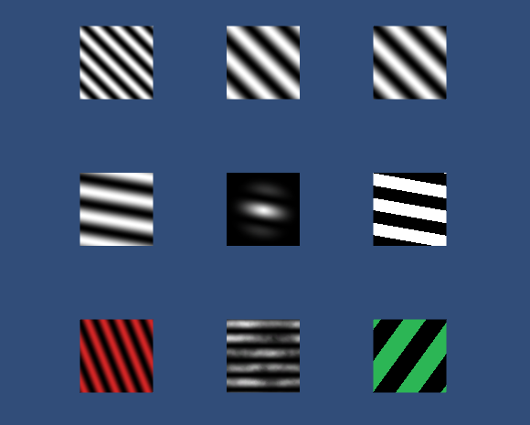
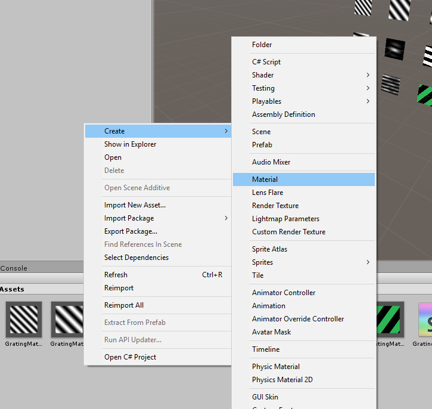
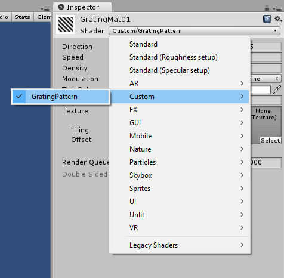
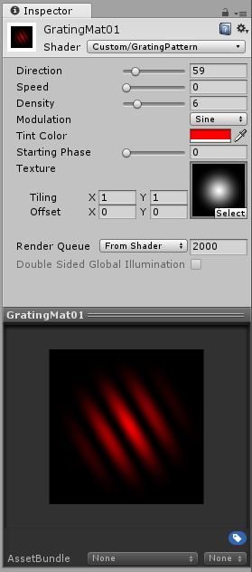

# UnityGratingShader
A shader for Unity that generates moving grating patterns.

# Requirements

- The Unity game engine. Get it here: https://unity3d.com/unity

# Useage

This repository includes a Unity project in the (\UnityGratingShader\UnityGratingShader) folder, however to make use of the shader you only need the GratingShader.shader file from the Assets folder.

- Start a Unity project or open an existing one
- Copy the GratingShader.shader file into the Assets folder
- Right click in the Assets directory, select: Create > Material 

- Select the material and in the Inspector set the Shader to Custom/GratingPattern 

- Apply this material to any GameObject that has a Mesh Renderer component

# Customization

You can customize how the grating pattern looks by selecting a Material that uses the GratingShader and changing its values in the inspector.

- **Direction** controls which way the lines of the pattern are aligned (in degrees). 0 is completely horizontal with the lines moving from top to bottom. Increasing the value rotates the pattern clockwise.
- **Speed** controls how fast the animation is playing. Note: The animation only plays while you are in play mode.
- **Density** controls how many lines are drawn
- **Modulation**  can be toggled between Sine and Square. The former results in smooth edges, the latter in sharp ones.
- **Tint Color** as the name implies tints the pattern with the selected color.
- **Starting Phase** sets an offset in degrees. This is proportional to the frequency so an offset of 360 looks exactly the same as 0.
- **Texture** can be optionally set to any image that you imported as an asset by dragging it onto the texture property. The image will be overlayed to the pattern. Tip: For a smooth circular cutoff you can use the Default-Particle texture built into Unity (press the Select button).

